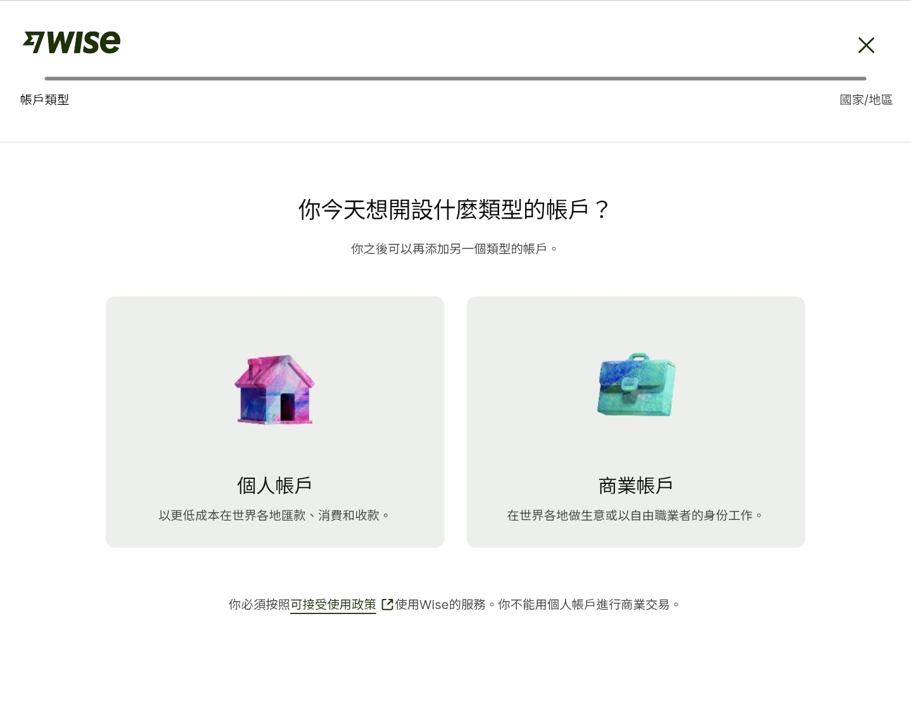
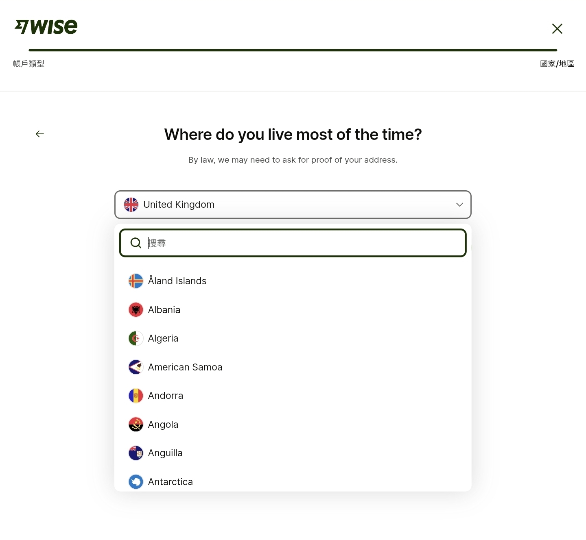
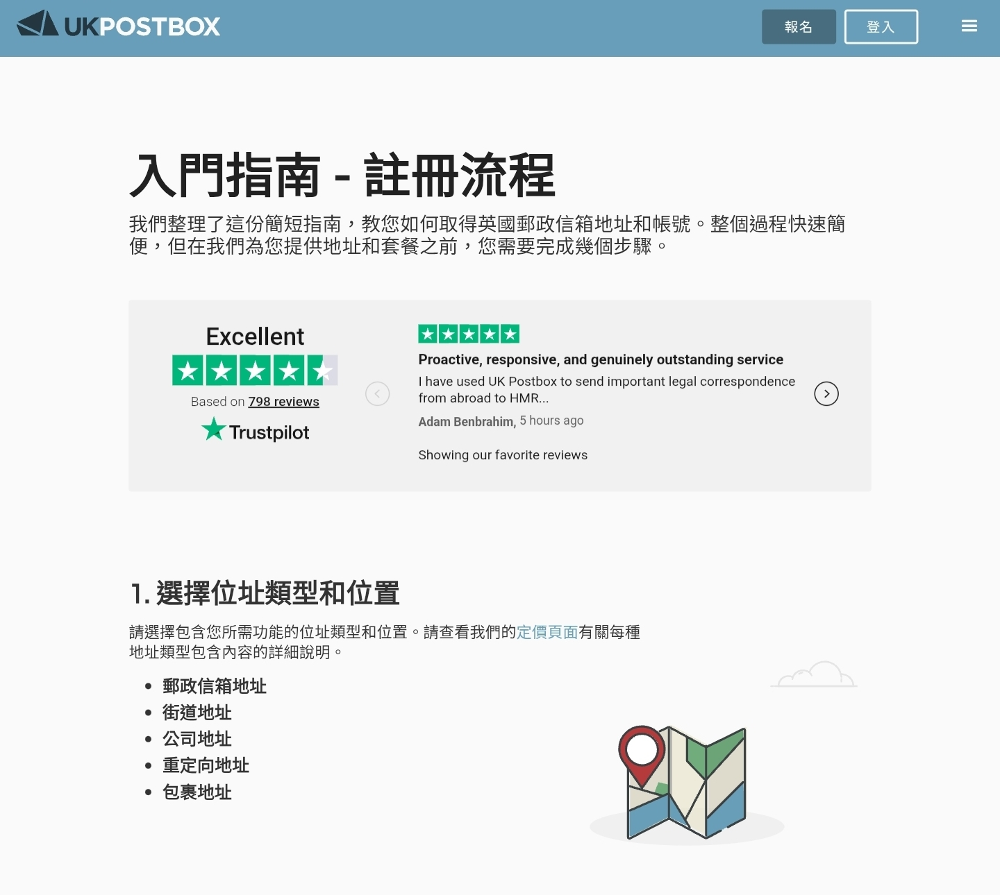

# Wise
##Wise 开户指南

邀请链接:https://wise.com/invite/ahpc/guitaoc1

Wise 是一家国际汇款与多币种账户平台，前身为 TransferWise。它支持：
多币种账户（USD、EUR、GBP 等）
国际汇款
本地收款账号
虚拟/实体银行卡
海外消费与转账
相比传统银行，Wise 通常汇率更透明、手续费更低，因此很多跨境电商、留学生、自由职业者和海外工作者都会使用。

##一、开户前准备

注册 Wise 账户前，建议提前准备：
个人账户所需材料
邮箱或手机号
身份证 / 护照
可接收验证码的手机
英文地址（建议真实可验证）
一张银行卡（用于首次充值验证）
企业账户额外需要
营业执照
公司英文名称
公司注册地址
法人身份证件
公司网站（部分情况会审核）

##二、Wise 注册流程

第一步：打开邀请链接

官方地址：
https://wise.com/invite/ahpc/guitaoc1

点击：
“Register”
或 “Sign up”
选择：
Personal（个人账户）
Business（企业账户）

第二步：填写基本信息

需要填写：
邮箱
手机号
登录密码
所在国家/地区
建议：
使用长期邮箱
手机号保持稳定
国家地区与证件一致

.

##第三步：身份验证（KYC）

Wise 会要求上传身份资料。
通常包括：
中国用户常见方式
护照（优先）
身份证（部分地区可用）
自拍验证
地址证明（有时需要）
可能要求：
银行账单
水电账单
信用卡账单
要求：
3个月内
姓名与地址一致
英文或可识别格式

激活账户

很多用户卡在这一步。
Wise 通常要求：
首次入金
或完成一笔小额充值
金额通常：
20美元
不同地区略有差异
可使用：
银行卡
Apple Pay
国际信用卡
成功后账户会正式激活。

如何获取多币种账户

开户成功后：
进入：
Account
Open balance
即可申请：
美元账户
英镑账户
欧元账户
澳元账户等
你会获得：
本地银行账号
SWIFT 信息
ACH / IBAN 等收款资料
适合：
接收海外工资
电商平台收款
海外客户付款

##六、Wise 卡片申请（部分地区）

Wise Card 可用于：
海外消费
ATM 取现
多币种自动换汇
支持：
Apple Pay
Google Pay
注意：
并非所有国家都能申请实体卡
中国大陆通常无法直接邮寄
注册UK Postbox用UK Postbox仓库转运地址填写进wise卡邮寄地址转运回国
邮寄信件有三种方式：平邮（Standard）、挂号信（Tracked & Signed）和DHL快递

https://www.ukpostbox.com/

##七、Wise 手续费说明

Wise 的费用主要包括：

汇款手续费
汇率点差（通常较低）
卡片 ATM 超额费用

优势：

汇率接近中间价
手续费透明
转账前可见最终到账金额

邀请链接:https://wise.com/invite/ahpc/guitaoc1

